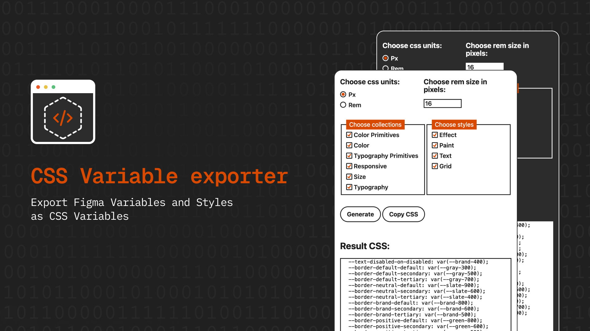
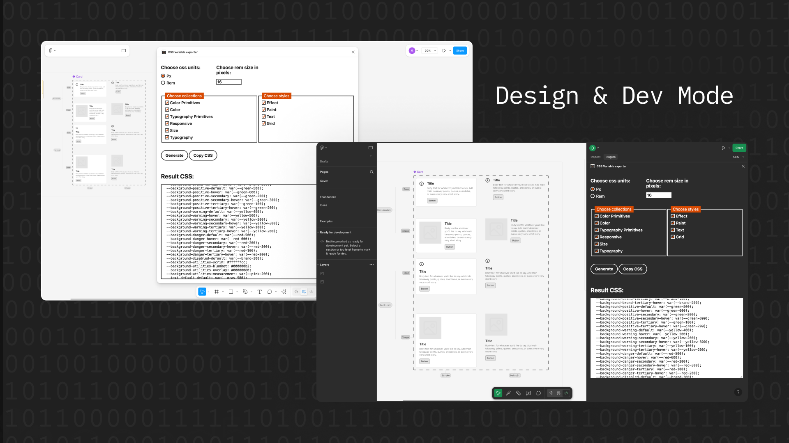

# Figma to CSS Variable Exporter

)

## About the plugin

Figma to CSS Variable Exporter is a Figma plugin designed to seamlessly export design tokens and variables from your Figma projects into a CSS-compatible format. This facilitates a smooth integration between design systems and development environments by allowing designers and developers to maintain interface consistency through shared styling standards.

))

## Features

– **Selectable Collections**: Easily select which Figma variable collections to export, streamlining the process and focusing only on the styles relevant to your project.

– **Flexible Export Formats**: Choose between px and rem units for exporting your CSS variables to align with your project's needs and preferences.

– **Customizable rem Base**: Specify the base pixel value for rem conversions, allowing for precise control over scaling and responsiveness in your designs.
